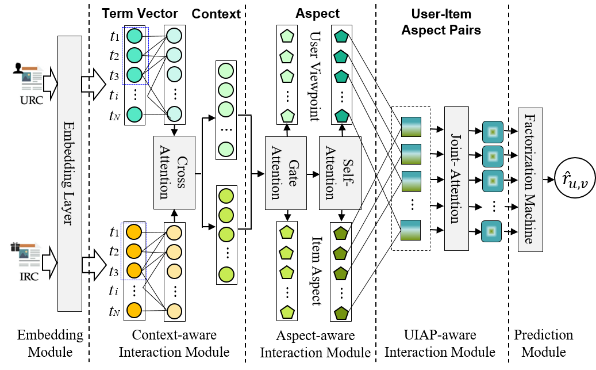

[](https://pubsonline.informs.org/journal/ijoc)

# From Interaction to Prediction: A Multi-Interactive Attention based Approach to Product Rating Prediction

This archive is distributed in association with the [INFORMS Journal on
Computing](https://pubsonline.informs.org/journal/ijoc) under the [MIT License](LICENSE).

The software and data in this repository are a snapshot of the software and data
that were used in the research reported on in the paper 
[From Interaction to Prediction: A Multi-Interactive Attention based Approach to Product Rating Prediction](https://doi.org/10.1287/ijoc.2023.0131) by Yu L, Gong W, Zhang D, and Ding Y. 


## Cite

To cite the contents of this repository, please cite both the paper and this repo, using their respective DOIs.

https://doi.org/10.1287/ijoc.2023.0131

https://doi.org/10.1287/ijoc.2023.0131.cd

Below is the BibTex for citing this snapshot of the repository.

```
@misc{CacheTest,
  author =        {Li Yu, Wei Gong, Dongsong Zhang and Yu Ding},
  publisher =     {INFORMS Journal on Computing},
  title =         {From Interaction to Prediction: A Multi-Interactive Attention based Approach to Product Rating Prediction},
  year =          {2024},
  doi =           {10.1287/ijoc.2023.0131.cd},
  url =           {https://github.com/INFORMSJoC/2023.0131},
  note =          {Available for download at https://github.com/INFORMSJoC/2023.0131},
}  
```

## Description
Despite increasing research on product rating prediction, very few studies have considered user-item interaction relationships at multiple levels. To address this critical limitation, we propose a novel Rating Prediction method based on Multi-Interaction Attention (RPMIA) by learning user-item interaction relationships at three levels simultaneously from online consumer reviews for predicting product ratings with reasonable interpretability. Specifically, RPMIA first deploys a multi-head cross attention mechanism to capture the interaction between contexts of items and users. Then, it uses a bi-layer gate-based mechanism to extract aspects of users and items, and a self-attention mechanism is further used to learn their interaction at the aspect level.
Finally, the aspects of users and items are coupled together to form meaningful user-item aspect pairs (UIAP) via a joint attention. A multi-task predictor that integrates a factorization machine and a feedforward neural network is designed to generate a rating prediction. We have empirically evaluated RPMIA with seven real-world datasets. The results demonstrate that RPMIA outperforms the state-of-the-art methods consistently and significantly. We also conduct a user study to assess the interpretability of the RPMIA method.



## Data and instructions to run RPMIA

We used seven publicly available [OCR datasets](http://jmcauley.ucsd.edu/data/amazon/) collected from Amazon.com on different products, including music instruments, office products, digital music, grocery & gourmet food,video games, tools & home improvement, and sports and outdoors products, which have been widely used for recommendation evaluation in previous studies.These datasets consist of consumers’ product ratings ranging from 1 to 5 and corresponding textual reviews. Each consumer or item has at least 5 reviews. All the datasets are in folder `dataset/` (where `dataset_D`->Digital Music，`dataset_G`->Grocery and Gourmet Food，`dataset_M`->Musical Instruments，`dataset_O`->Office Products，`dataset_S`->Sports and Outdoors，`dataset_T`->Tools and Home Improvement，`dataset_V`->Video Games. In this repository, we use `dataset_G` as an example).

The code `src/RPMIA.py` implements and RPMIA model. In this implementation, we define five modules, including an embedding module, a context-aware module, an aspect-aware module, a UIAP-aware module, and a prediction module.

The package `_auxiliaryTools/` implements data preprocessing of datasets, where code `ExtractData.py` implements extracting dataset from file, `Evaluation.py` defines a function named `get_test_list_mask` to batch process test data (including user ID, item ID, rating, etc.) and related user reviews, item reviews, and mask information according to a given batch size, and return multiple lists containing batches of different types of data. 

Use the following command to run the code:
```
python src/RPMIA.py
```


## Prerequisties (please install the following packages before you run our RPMIA model)
- tensorflow 1.15
- python 3.6
- numpy 1.19.2
- pandas 1.1.5